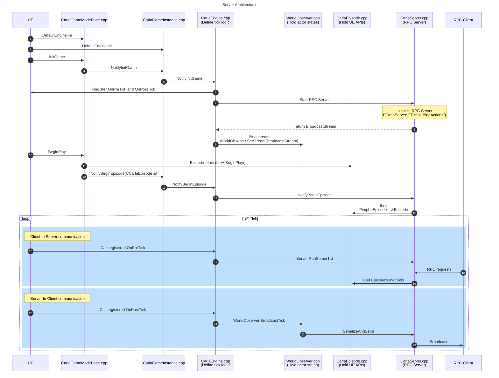
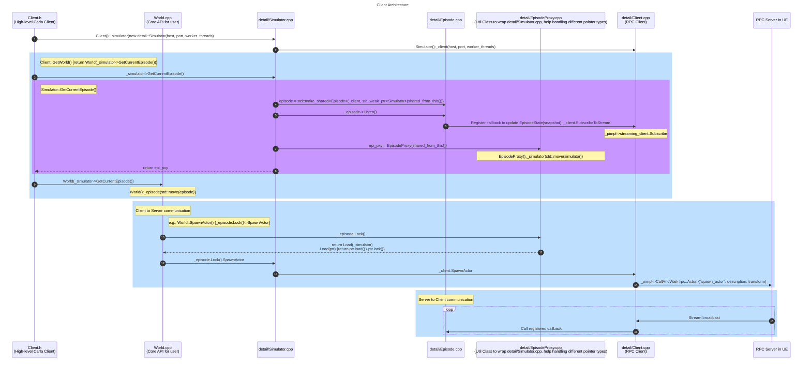

# 前言

总结了一下CarlaUE5的整体代码架构，该总结基于以下代码：

- repo: https://github.com/carla-simulator/carla.git
- branch: `ue5-dev`
- commit: `141a8a2`

# 整体架构

<!-- <div style="width:400px; margin-left:auto; margin-right:auto;" > -->
<div style="max-width: 100%; margin: 0 auto;">
  
</div>

# Server架构

<!-- <div style="width:auto; margin-left:auto; margin-right:auto;" > -->
<div style="max-width: 100%; margin: 0 auto;">
  
</div>

# Client架构

<!-- <div style="width:400px; margin-left:auto; margin-right:auto;" > -->
<div style="max-width: 100%; margin: 0 auto;">
  
</div>

# PythonAPI

<!-- <div style="width:400px; margin-left:auto; margin-right:auto;" > -->
<div style="max-width: 100%; margin: 0 auto;">
  
</div>

# 一些C++知识点

## `weak_ptr`

- motivation：只有`shared_ptr`的话会出现循环引用的问题
- 具体来说，就是搞一个阉割版的，不会影响计数的“智能指针”，也就是`weak_ptr`了
- `weak_ptr`不能直接用，只能先通过`.lock()`提级（构造）为`shared_ptr`之后再用
- [这个blog](https://blog.csdn.net/qq_38410730/article/details/105903979)和[这个blog](https://blog.csdn.net/Xiejingfa/article/details/50772571)讲解得挺好的

## `atomic`

- motivation：针对变量的高效线程安全读写工具
- 相比`lock`, `mutex`这些要跟跟内核打交道（有用户态和内核态的切换开销）的多线程工具，`atomic`属于硬件指令集的工具，效率更高
- 对于`atomic<int> ai;`，需要调用`ai.load()`和`ai.store(1)`进行读写
- 又由于编译器会对代码的实际执行顺序进行优化，`atomic`提供了一些指令去控制代码的执行顺序，具体可以参考[这个blog](https://www.cnblogs.com/kekec/p/14470150.html)

## `enable_shared_from_this`

- motivation：使得成员函数使用`shared_ptr<T>(this)`成为可能。假如没有额外支持的话，成员函数直接裸使用`shared_ptr<T>(this)`会导致`this`被析构两次
- 核心要做的事情就是使得对象知道管理自己的`shared_ptr`是什么。具体来说：
    - `esft`是个模板类，我们需要继承他。这个类里有一个`weak_ptr`成员，语意是指向管理本对象的`shared_ptr`；同时会提供一个`shared_from_this`方法，去调用`weak_ptr.lock()`
    - 在调用`make_shared`的时候，会调用`dynamic_cast`来检查当前要构造的对象是否继承自`esft`，假如是，就会将其`weak_ptr`对象指向`shared_ptr`
- 关于这部分，可以参考[这个blog](https://blog.csdn.net/caoshangpa/article/details/79392878)

## `mutable`

- motivation：允许`const`成员函数修改的成员变量

## `pImpl`

- motivation
    - 完全隐藏实现细节
    - 避免修改成员变量引起头文件变化
- 具体来说，就是
    - 在类的`private`里面前向声明一个`Impl`类
    - 成员变量只保留一个指向`Impl`类的`unique_ptr`

## `compare_exchange`

- motivation：解决多线程编程时，读到的值在要用的时候可能已经被修改的问题，主要用于条件赋值，否则直接用`store`就好了
- 思路就是在用的时候再验一下货。具体来说，就是搞了一个包含比较和赋值这两个指令的原子操作，只有当`self`跟`expected`相等的时候，`self`才会被赋值为`target`
- 这个也被叫做CAS(Compare and Swap)，属于无锁编程的概念。
- 可以参考[这个blog](https://mk.woa.com/q/295415/answer/123484?kmref=vkm_push)

<!-- ```mermaid
---
title: Carla Architecture
---
flowchart LR
    PY[Python API]
    C_CPP[C++ Carla Client]
    C_RPC[C++ RPC Client]
    S_RPC[C++ RPC Server]
    S_PLUGIN[C++ Carla UE5 Plugin]
    UE[UE]
    PY --- |boost python| C_CPP
    subgraph "Client (LibCarla)"
    C_CPP --- C_RPC
    end

    C_RPC <--RPC--> S_RPC

    subgraph Server
    S_RPC --- S_PLUGIN
    S_PLUGIN --- UE
    end
```





```mermaid
---
title: Python API
---
flowchart LR
    LIBCARLA[LibCarla]
    H[PythonAPI.h]
    CPP[PythonAPI.cpp]
    CLIENT[PythonAPI\carla\src\Client.cpp]
    WORLD[PythonAPI\carla\src\World.cpp]

    LIBCARLA ---|include| H

    subgraph "Main of boost python"
    H --- CPP 
    end

    subgraph Exporter
    CPP --- CLIENT 
    CPP --- WORLD
    CPP --- ...
    end
``` -->